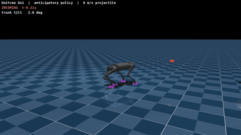
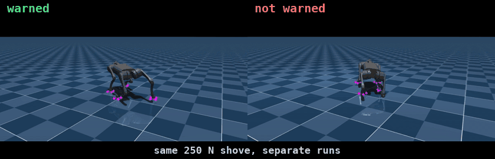
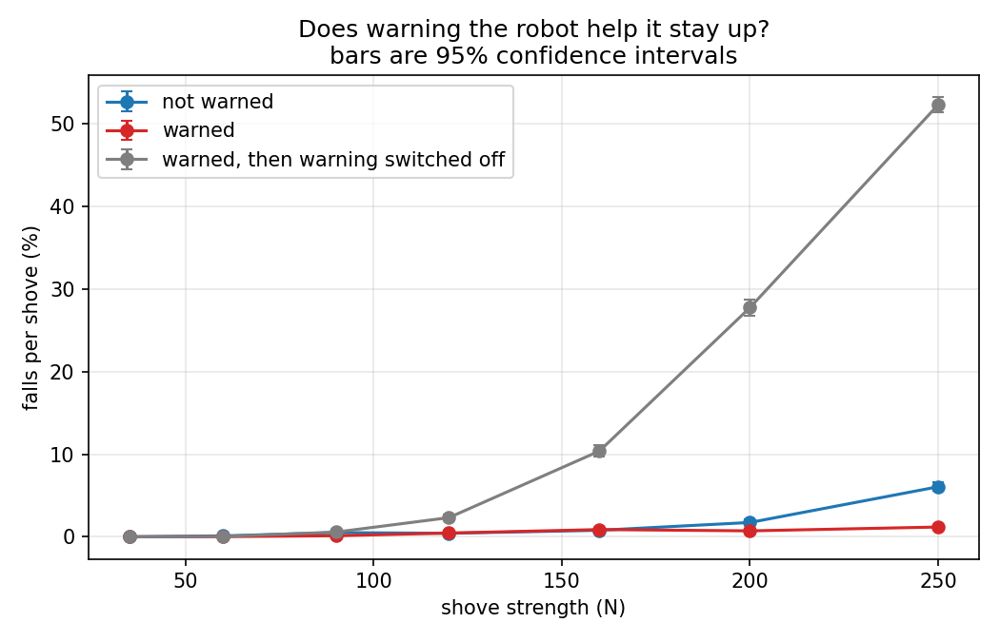
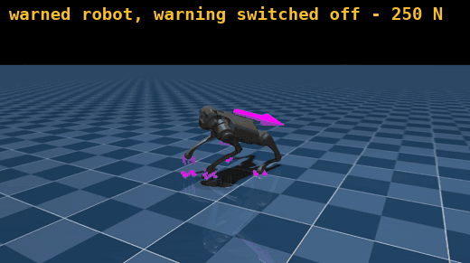
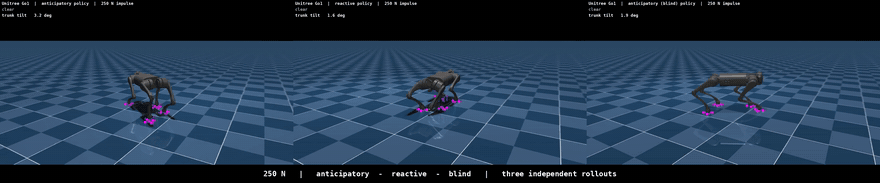
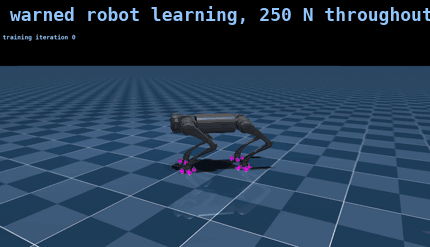

# Bracing for a hit

**If you warn a walking robot that a shove is coming, does it stay on its feet?**

I trained two simulated robot dogs to walk. Both got shoved from random directions while
walking, over and over. The only difference between them: one got a heads-up shortly
before each shove, telling it which direction the shove was coming from, how hard, and
how long until it landed. The other got nothing and had to deal with the shove after it
arrived.

Then I shoved both of them about 150,000 times and counted how often they fell.

The warning helps a lot, but only against hard shoves. It also came with a catch I did
not expect.



## What happened

For the hardest shove I tested (250 N, roughly 1.8 times the robot's own weight, pushed
sideways):

| robot | how often it fell |
|---|---|
| warned | 1 fall every 84 shoves (1.2%) |
| not warned | 1 fall every 16 shoves (6.1%) |
| warned while learning, then warning switched off | 1 fall every 2 shoves (52.3%) |



The warned robot on the left drops its hips and widens its stance before the shove
arrives. The unwarned one on the right only starts reacting once it is already moving.



### 1. The warning only matters once the shove is hard

For gentle and medium shoves, the two robots are the same. At 160 N they fall 0.9% and
0.8% of the time, which is a tie. Reacting after the shove lands is simply fast enough at
that strength: the robot thinks 50 times a second, so it has time to catch itself.

The gap only opens at 200 N and becomes large at 250 N, where the warned robot falls five
times less often.

This is worth knowing because the obvious experiment misses it. If I had only tested up
to 160 N, the honest conclusion would have been "warning the robot does nothing."

### 2. The robot really is using the warning

I took the trained warned robot and fed it zeros where the warning normally goes. Nothing
else changed. It went from falling 1.2% of the time to 52.3%.

That is the difference between a robot that happens to be good and a robot that is good
*because of* the warning. Without this check, the first result could have been luck in
how the two training runs happened to go.

### 3. The warning became a crutch

This is the part I did not see coming.



That is the same robot from the left of the earlier clip, taking the same 250 N shove,
with its warning fed as zeros.

The robot that trained with warnings, once the warning was removed, fell **52.3%** of the
time. The robot that never had a warning at all falls **6.1%** of the time.

So taking the warning away did not knock the warned robot back down to normal. It left it
about nine times worse than normal. It never learned to catch itself the hard way, because
it never had to. It learned one skill, "brace when told", instead of the more general
skill of recovering from a shove.

If you built a real robot this way, and its warning came from a camera or a sensor that
failed, you would not get an average robot. You would get one much worse than if you had
never given it a warning. Making a robot cope when the warning disappears is a separate
job, and you do not get it for free.

## The full numbers

Both robots practised for 4000 rounds (393 million simulated steps each), then I froze
them and tested each at seven fixed shove strengths with 1024 robots running in parallel.
Between 6,692 and 11,188 shoves per box in the table. The ranges are 95% confidence
intervals.

How often each robot falls, per shove:

| shove | warned | not warned | warning switched off |
|---:|---|---|---|
| 35 N | 0.0% | 0.0% | 0.0% |
| 60 N | 0.0% | 0.1% | 0.0% |
| 90 N | 0.1% | 0.5% | 0.6% |
| 120 N | 0.5% | 0.4% | 2.3% |
| 160 N | 0.9% | 0.8% | 10.4% |
| 200 N | 0.7% | 1.7% | 27.8% |
| 250 N | 1.2% [1.0, 1.5] | 6.1% [5.5, 6.6] | 52.3% [51.4, 53.2] |

How far the robot's body tipped, on average. Past 70 degrees counts as a fall:

| shove | warned | not warned | warning switched off |
|---:|---|---|---|
| 35 N | 4.9° | 5.6° | 5.5° |
| 120 N | 13.0° | 15.9° | 21.2° |
| 250 N | 16.5° | 29.2° | 54.2° |

The warned robot tips about as far under the hardest shove as the unwarned one does under
a medium shove, and less far than the warning-switched-off robot does under that same
medium shove.

## What this does not prove

**I only trained each robot once.** The confidence intervals above cover the testing, not
the training. Train the same setup again with a different random start and you can get a
somewhat different robot. The crutch finding (point 3) is safe from this, because it
compares one robot against itself with the warning switched off. The headline comparison
between the two robots is not. Running three to five copies of each is the first thing
this needs.

**The shoves stopped getting harder before the robots stopped improving.** During
training the shove strength rises whenever a robot survives, so each robot is always
pushed near its limit. Both robots hit my 250 N ceiling and stayed there. I picked that
ceiling by calculating how hard you would have to shove a 13.93 kg object floating in
space, and forgot that four legs on the ground soak up a lot of the blow. So the ceiling
was too low, and I lost a free extra result.

**It is all simulation.** No real robot was involved. The shove is a force applied
directly to the robot's body, not something bumping into it. The warning is also perfect:
exactly the right direction, strength and timing, every time. A real robot's warning would
be noisy and sometimes wrong, and given how badly this robot does when the warning
disappears, how it copes with a *wrong* warning is an open and fairly important question.

More in [docs/limitations.md](docs/limitations.md).

## Watch it



Left to right: warned, not warned, warning switched off. All three at 250 N. These are
three separate runs, not the same shoves replayed, so treat it as an illustration of the
difference rather than the measurement itself.

Learning to do it, sampled across all 81 saved checkpoints:



All 40 videos are attached to the
[latest release](https://github.com/mitanshu-2004/brace-for-impact/releases/latest): every robot
at every shove strength, both robots learning from scratch, side-by-side comparisons, and
a version where a real 5 kg ball is thrown at the robot instead of applying a force.
[docs/videos.md](docs/videos.md) lists them.

## Try it

```bash
pip install -e ".[analysis,video,dev]"
pytest                                   # check the install
```

Needs Python 3.10+ and an NVIDIA GPU.

```bash
python scripts/train.py warned   --iters 4000     # about 2.4 hours on a T4
python scripts/train.py unwarned --iters 4000
```

To skip training, both finished robots are attached to the
[release](https://github.com/mitanshu-2004/brace-for-impact/releases/latest) as
`warned_final.pt` and `unwarned_final.pt`, about 5 MB each. The full set of saved
checkpoints from training is there too, as `warned_training.tar` and
`unwarned_training.tar`, if you want the learning curves or want to re-make the
learning videos.

```bash
python scripts/eval.py --robot warned   --checkpoint logs/rsl_rl/brace_warned/model_3999.pt
python scripts/eval.py --robot unwarned --checkpoint logs/rsl_rl/brace_unwarned/model_3999.pt
python scripts/eval.py --robot warned   --checkpoint logs/rsl_rl/brace_warned/model_3999.pt --no-warning
python scripts/analyze.py
```

`eval.py` writes one line per shove, so you can recompute any number in this README from
`results/*.csv` without running anything again.

Making the videos needs a machine with proper NVIDIA graphics drivers, which most cloud
notebooks do not have. See [docs/mjlab-notes.md](docs/mjlab-notes.md).

```bash
bash scripts/render_all.sh
bash scripts/compose.sh all
```

## How it works, briefly

The robot walks on flat ground following speed commands. Every 3 to 6 seconds something
shoves its body from a random direction, slightly above its centre, so it tips rather than
just slides. It has to keep walking and stay upright.

The shoves get harder for any robot that survives and gentler for any robot that falls, so
all 4096 robots training in parallel are always being pushed near their personal limit.

The warning the robot sees is four numbers: two for the direction, one for how hard, one
for how long until it lands. All four are zero when nothing is coming. Deleting those four
numbers from what the robot senses, and nothing else, is the entire difference between the
two robots.

The value estimator used during training sees the warning for both robots. Only the part
that chooses actions differs. Otherwise the unwarned robot would be handicapped twice.

Full detail in [docs/how-it-works.md](docs/how-it-works.md).

## What is mine and what is not

The robot model, the walking task, the training algorithm, and the reward functions all
come from [mjlab](https://github.com/mujocolab/mjlab). I wrote about 450 lines on top:

- `brace_task/threat_command.py` picks a shove, counts down to it, tells the robot what is
  coming, applies the force, clears it afterwards, and draws the arrow you see in the
  videos.
- `brace_task/curriculum.py` moves each robot up or down the difficulty ladder.
- `brace_task/brace_env_cfg.py` sets up the two robots, which differ by one line.

I wrote no reward functions. mjlab already has the ones this task needs, and adding my own
would have introduced differences that had nothing to do with the question.

I also removed mjlab's built-in random push, which is an instant velocity change that
ignores mass and cannot be aimed, scaled, or announced. Leaving it in would have added a
second kind of shove that neither robot could ever be warned about.

## What is in this repo

```
brace_task/   the robot's task: the shove, the difficulty ladder, the two setups
scripts/      train, test, analyse, and make the videos
tests/        checks that the two setups differ by exactly one thing
docs/         how it works, limitations, notes on mjlab
results/      one line per shove, about 148,000 of them, plus the chart
```

## License

MIT. mjlab is Apache 2.0 and is used as a dependency, not copied in.
